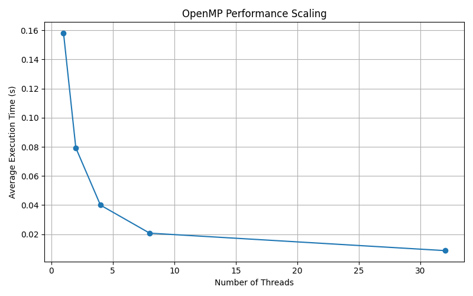
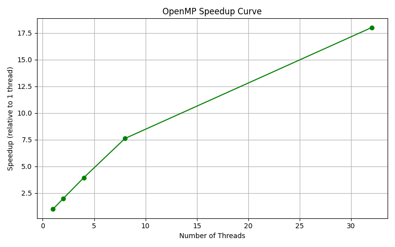

### **1. `salloc` command line used**

To allocate a compute node interactively:

```bash
salloc --cpus-per-task=8 <executable_path>
```

### **2. Maximum number of cores M on the node**

80 (I used the command )

### **3. How I set different N_t’s**

```bash
export OMP_NUM_THREADS=1   # For N1
./omp_hello2

export OMP_NUM_THREADS=2   # For N2
./omp_hello2

export OMP_NUM_THREADS=4   # For N3
./omp_hello2
```

### **4. Record execution times and plot averages**



### **5. Speedup relative to N_1**

(each point represents N_i at i)


### **6. Questions**

**(a) Why printed messages may differ in order for a given N_t**

OpenMP threads run concurrently; the exact timing of each thread is not known in advance, printing from multiple threads can cause random-looking output orders.

**(b) Why execution times may be larger for larger N_t**

Thread management overhead increases with more threads.

**(c) How to modify the code to obtain speedup > 1 for all N_t**

By choosing values of N_t which lie between 16 and 64?

**(d) Type of parallelism in `omp_hello2.c`**

Data parallelism

**(e) Modify code to avoid `if (tid == 0)` while keeping master print**

```c
#pragma omp parallel
{
    int tid = omp_get_thread_num();
    #pragma omp master
    {
        printf("Hello from the master thread!\n");
    }
    printf("Hello from thread %d\n", tid);
}
```
