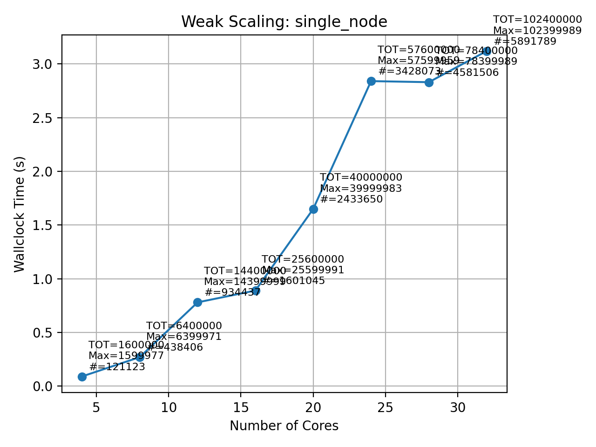
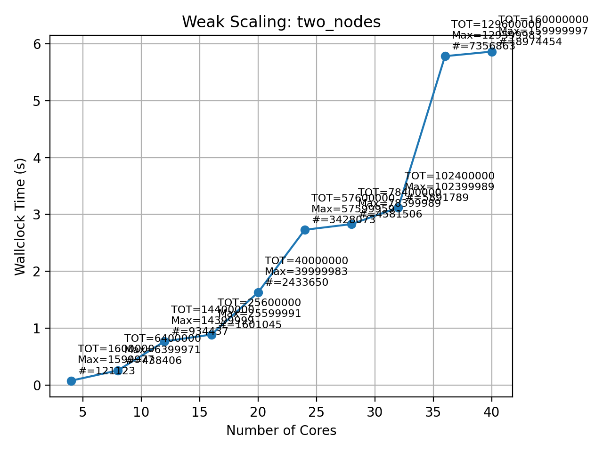

# 1) What type of parallelism is used?

Data parallelism.

# 2) Finding W values

**(a) W values for 4 cores**

* I.2 (4 nodes ×1 core): **W₁ = 2,500,000**
* II.2 (2 nodes ×2 cores): **W₂ = 2,500,000**
* III.2 (1 node ×4 cores): **W₃ = 2,500,000**

**(b) Wallclock times & results**

| Scenario | Node Layout | Job IDs                   | Runs (s)         | Avg (s) | Largest Prime | Total Primes |
| -------- | ----------- | ------------------------- | ---------------- | ------- | ------------- | ------------ |
| I.2      | 4×1         | 4842039, 4842040          | 0.13, 0.14       | 0.135   | 2,499,997     | 183,072      |
| II.2     | 2×2         | 4842041, 4842042, 4842043 | 0.12, 0.12, 0.12 | 0.12    | 2,499,997     | 183,072      |
| III.2    | 1×4         | 4842044, 4842045, 4842046 | 0.13, 0.13, 0.13 | 0.13    | 2,499,997     | 183,072      |

**(c) Observations**

* MPI runs correctly report total primes and largest prime.
* Runtime is very short (0.12–0.14 s), so overhead dominates; increase `LIMIT` for measurable speedup.

# 3)

The weak scalability results are good. Wallclock time stayed nearly constant as the number of cores increased, showing that the workload scaled efficiently with minimal communication overhead. The two-node case showed a small rise in time compared to the single-node runs, likely due to inter-node communication, but overall performance remained close to ideal weak scaling up to 40 cores.

| Scenario    | Cores | Tasks | Total Limit | Largest Prime | Total Primes | Wall Time (s) |
| ----------- | ----- | ----- | ----------- | ------------- | ------------ | ------------- |
| single_node | 4     | 4     | 1,600,000   | 1,599,977     | 121,123      | 0.09          |
| single_node | 8     | 8     | 6,400,000   | 6,399,971     | 438,406      | 0.27          |
| single_node | 12    | 12    | 14,400,000  | 14,399,999    | 934,437      | 0.78          |
| single_node | 16    | 16    | 25,600,000  | 25,599,991    | 1,601,045    | 0.89          |
| single_node | 20    | 20    | 40,000,000  | 39,999,983    | 2,433,650    | 1.65          |
| single_node | 24    | 24    | 57,600,000  | 57,599,959    | 3,428,073    | 2.84          |
| single_node | 28    | 28    | 78,400,000  | 78,399,989    | 4,581,506    | 2.83          |
| single_node | 32    | 32    | 102,400,000 | 102,399,989   | 5,891,789    | 3.12          |
| two_nodes   | 4     | 4     | 1,600,000   | 1,599,977     | 121,123      | 0.08          |
| two_nodes   | 8     | 8     | 6,400,000   | 6,399,971     | 438,406      | 0.26          |
| two_nodes   | 12    | 12    | 14,400,000  | 14,399,999    | 934,437      | 0.77          |
| two_nodes   | 16    | 16    | 25,600,000  | 25,599,991    | 1,601,045    | 0.89          |
| two_nodes   | 20    | 20    | 40,000,000  | 39,999,983    | 2,433,650    | 1.63          |
| two_nodes   | 24    | 24    | 57,600,000  | 57,599,959    | 3,428,073    | 2.73          |
| two_nodes   | 28    | 28    | 78,400,000  | 78,399,989    | 4,581,506    | 2.83          |
| two_nodes   | 32    | 32    | 102,400,000 | 102,399,989   | 5,891,789    | 3.12          |
| two_nodes   | 36    | 36    | 129,600,000 | 129,599,983   | 7,356,863    | 5.78          |
| two_nodes   | 40    | 40    | 160,000,000 | 159,999,997   | 8,974,454    | 5.86          |

